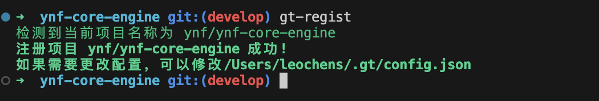
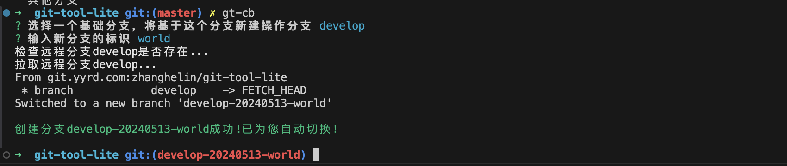
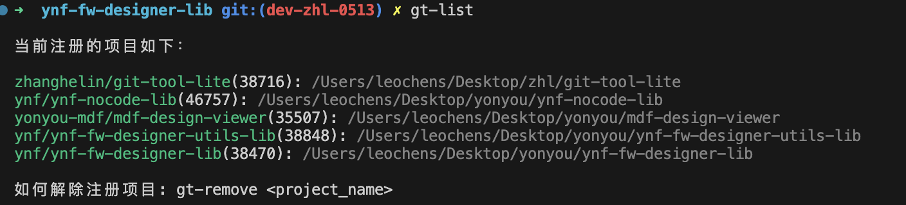
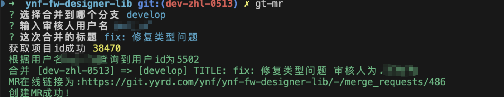
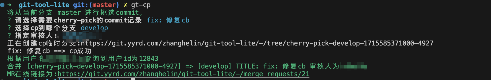

# gitlaboy

适配GitLab的cli客户端，可以提供创建mr,创建cherry-pick等操作。

## 工具特点

1. 按照规范创建分支
2. 在任意分支提mr
2. 在任意分支提cherry-pick

## 安装说明

### 前置环境
需要安装[node](https://nodejs.org/en)(版本大于18)和npm

### 安装命令
环境安装完成后，执行下面命令进行全局安装：
```shell
sudo npm install -g gitlaboy
```


## 使用说明

### 初始化

安装成功后，需要执行命令
```shell
sudo gt-init
```
(windows请用管理员权限执行此命令)

进行工具初始化，此时会要求你输入常用配置，如git的地址以及秘钥等配置。

### 项目注册
```shell
sudo gt-regist
```
在gitlab的项目目录下执行这个命令，会自动注册这个项目。
原理是根据当前项目的git配置，在gitLab中查找对应项目，如果出现多个，会在用户选择后注册。


### 使用方式
#### `gt-cb` 选定一个分支，基于它创建新分支。
```shell
gt-cb
```



#### `gt-list` 展示当前已经注册的项目。

```shell
gt-list
```



#### `gt-mr` 将当前分支创建mr到指定分支上，并展示在线链接。

```shell
gt-mr
```



#### `gt-cp` 将当前分支的commits进行cherry-pick到其他分支。

```shell
gt-cp
```



### 老用户升级
```shell
sudo npm update -g gitlaboy
```

## Q&A

* gt 找不到命令：检查一下是否是全局安装。
* 命令提示没有权限 使用sudo(mac环境) 或者 管理员权限执行命令(windows) 
* 使用命令时报错，更新Node版本到18以上
> 有任何使用问题可以提issue哈

